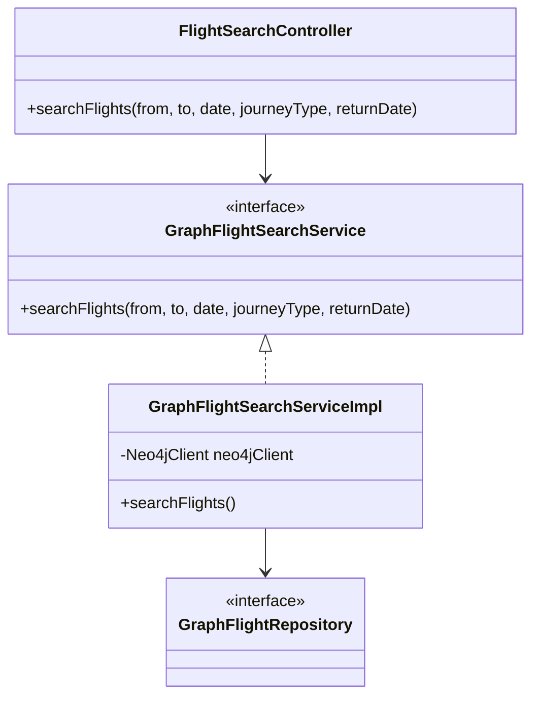
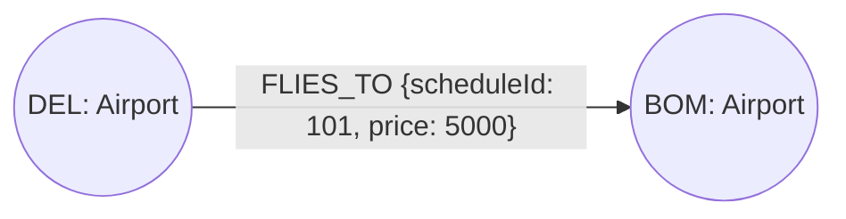
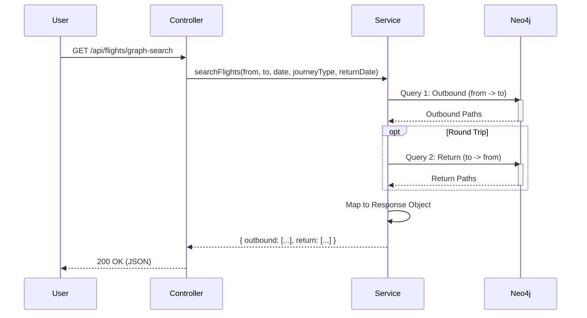
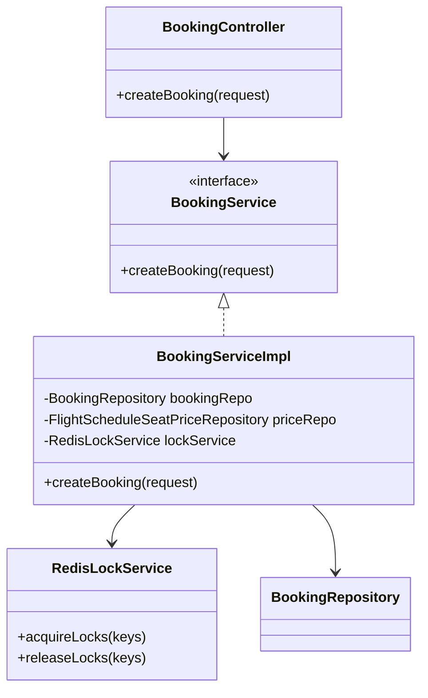
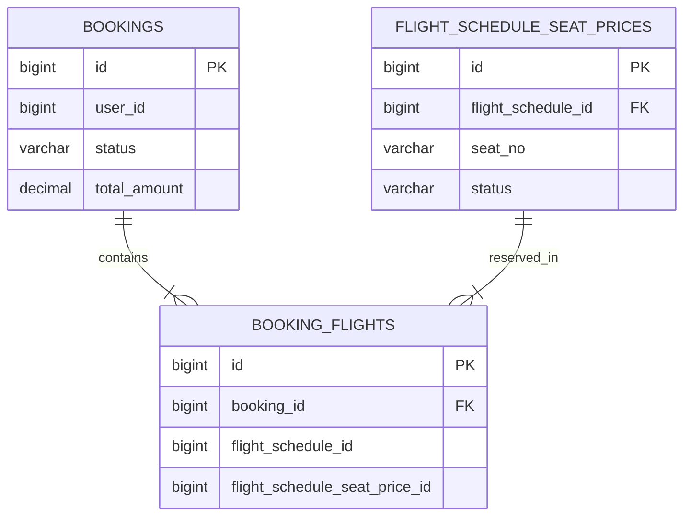
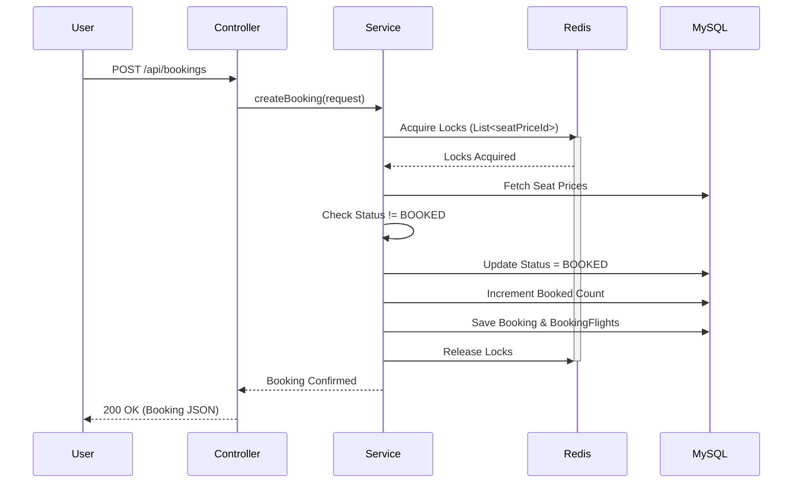

# Component Deep Dive: Search & Booking

## 1. Search Component (Neo4j)

### Overview
The search component uses **Neo4j** to enable efficient route finding, specifically handling connecting flights which are computationally expensive in recursive SQL queries.

### Graph Data Model
-   **Airport Node**: Represents physical locations.
    -   Properties: `code` (e.g., DEL), `city`, `name`.
-   **FLIES_TO Relationship**: Represents a specific scheduled flight.
    -   Properties: `scheduleId` (Refers to MySQL ID), `departureTime`, `arrivalTime`, `price`.

### Search Logic (`GraphFlightSearchServiceImpl`)
We use **Cypher** queries to traverse the graph.

#### Algorithm: Finding 1-Stop Connections
1.  **Match**: Find a path `(StartAirport)-[r1]->(Layover)-[r2]->(EndAirport)`.
2.  **Constraints**:
    -   `r1.arrivalTime` + Buffer (e.g., 2 hrs) < `r2.departureTime`.
    -   `r2.departureTime` is within a reasonable window from `r1`.
3.  **Return**: Construct a list of flights representing the journey.
4.  **Round Trip Logic**:
    -   If `journeyType` is `ROUND_TRIP`, the service executes the above search twice:
        -   **Outbound**: `from` -> `to` on `date`.
        -   **Return**: `to` -> `from` on `returnDate`.
    -   Results are bundled into an object containing both lists.

```cypher
MATCH (a:Airport {code: $from})-[f1:FLIES_TO]->(layover)-[f2:FLIES_TO]->(b:Airport {code: $to})
WHERE 
  f1.departureTime >= $startTime AND f1.departureTime <= $endTime
  AND
  duration.inSeconds(f1.arrivalTime, f2.departureTime).seconds >= 7200 -- 2 hour buffer
RETURN f1, f2
```

### Class Diagram



### Infrastructure Deep Dive: Neo4j
**Role**: Graph Database (Search Engine)
-   **Why Graph?**: Traditional SQL requires expensive recursive joins to find connecting flights (e.g., A->B->C). Graph databases store these relationships physically, allowing O(1) traversal per hop. This reduces search time from O(n) or O(log n) joins to simple pointer chasing.
-   **Topology**: Airports are nodes. Flight schedules are directed relationships with properties (time, price).

### Database Schema (Neo4j Graph Model)
This model mirrors the connectivity of the physical world.
-   **Nodes**: `(:Airport {code, city})`
-   **Relationships**: `(:Airport)-[:FLIES_TO {scheduleId, depTime, arrTime}]->(:Airport)`



### Search Sequence Diagram



## 2. Booking Component (Distributed Locking)

### Overview
The booking component ensures atomic transactions across multiple flight legs and multiple users. It leverages **Redis (Redisson)** for distributed locking to prevent "overbooking" race conditions.

### Distributed Locking Strategy
-   **Lock Granularity**: Locks are acquired on individual **Seat Price IDs** (`FlightScheduleSeatPrice`). This is fine-grained, allowing high concurrency for different seats on the same flight.
-   **Lock Key Format**: `LOCK_SEAT_PRICE_{ID}`.
-   **Library**: `Redisson` RMultiLock.

### Transaction Flow
1.  **Request**: `createBooking(BookingRequest)`
2.  **Validation**: Check if inputs are valid.
3.  **Lock Acquisition**:
    -   Identify all required Seat Price IDs.
    -   Try to acquire locks for ALL IDs atomically. If fail, abort.
4.  **Availability Check (Critical Section)**:
    -   Retrieve `FlightScheduleSeatPrice` entities.
    -   **Double Check**: Ensure status is NOT `BOOKED` (Guard against race condition before lock).
    -   **Update**: Set status to `BOOKED`.
    -   **Inventory**: Increment `bookedSeats` in `FlightScheduleSeat`.
5.  **Persistence**:
    -   Save `Booking`, `BookingFlight`s, and updated Seat Prices to MySQL.
6.  **Release Locks**: Always release locks in `finally` block.

### Infrastructure Deep Dive: Redis & Kafka
1.  **Redis (Distributed Locks)**:
    -   **Role**: Distributed Lock Manager.
    -   **Why**: To prevent race conditions where multiple users try to book the last seat simultaneously. Java/synchronized locks only work on a single server, not a distributed cluster.
2.  **Kafka (Event Streaming)**:
    -   **Role**: Asynchronous Communication Bus.
    -   **Why**: Decouples Booking from Payment. The Booking service doesn't need to wait synchronously for payment processing. It listens for `PaymentSuccess` events to confirm bookings, improving system throughput and resilience.

### Class Diagram



### Database Schema (MySQL ER Diagram)



### Booking Sequence Diagram



## 3. Data Consistency
-   **MySQL**: Acts as the source of truth for financial and inventory records.
-   **Redis**: Acts as the concurrency control layer.
-   **Neo4j**: Optimized read model. Requires synchronization (currently seeded on startup, but in production would listen to MySQL Change Data Capture events).
