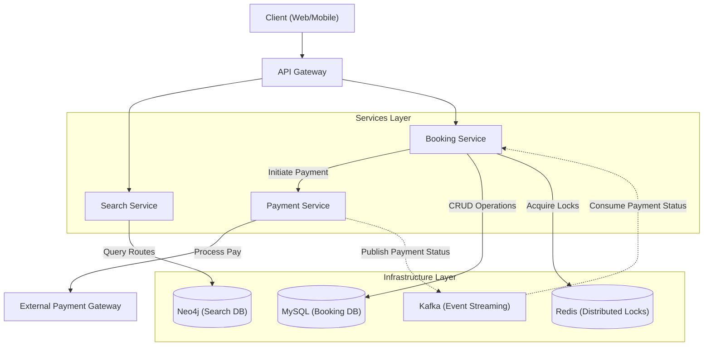
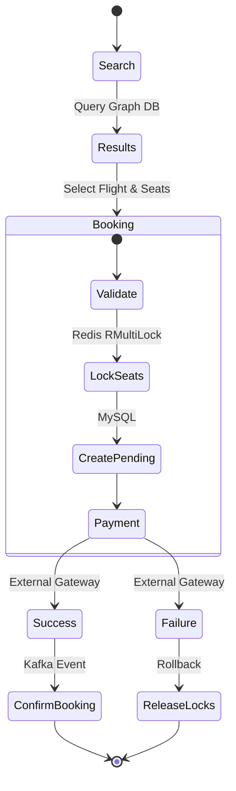

# Flight Booking System - System Design

## 1. Requirements

### Functional Requirements
1.  **User Management**: Users can register and login (simplified for this scope).
2.  **Flight Search**:
    -   Users can search for *direct flights*.
    -   Users can search for *connecting flights* (up to 1 stop).
    -   **Journey Type**: Supports `ONE_WAY` and `ROUND_TRIP`.
    -   Results include details for outbound (and return) flights.
3.  **Booking Management**:
    -   Users can book a flight (or multiple legs for a journey).
    -   Multiple passengers can be booked in a single transaction.
    -   Seat availability is checked and updated in real-time.
    -   Distributed locking ensures no double-booking of the same seat.
    -   Users can view their booking history.
4.  **Payment**:
    -   Payment processing is integrated (stubbed for prototype).
    -   Booking is confirmed only upon successful payment.

### Non-Functional Requirements
1.  **Data Consistency**: Zero tolerance for double-booking. ACID properties must be maintained across flight legs.
2.  **Concurrency**: The system must handle multiple users trying to book the same flight simultaneously without race conditions.
3.  **Scalability**: The search component calls for graph database efficiency (Neo4j) to handle complex route queries effectively as data grows.
4.  **Availability**: The system should be resilient; core booking data is in MySQL, while Search is powered by Neo4j and Locking by Redis.

## 2. Core Entities

### Relational Model (MySQL)
-   **User**: `id`, `username`, `email`, `password`
-   **Flight**: `id`, `flightNumber`, `airline`
-   **FlightSchedule**: `id`, `flight_id`, `from`, `to`, `startTime`, `endTime`, `price`
-   **FlightScheduleSeat**: `id`, `schedule_id`, `seatType`, `totalSeats`, `bookedSeats`
-   **FlightScheduleSeatPrice**: `id`, `schedule_id`, `seatNo`, `seatType`, `price`, `status`
-   **Booking**: `id`, `userId`, `noSeats`, `totalAmount`, `status`, `bookingTime`
-   **BookingFlight**: `id`, `booking_id`, `flight_schedule_id`, `flight_schedule_seat_price_id`
-   **Payment**: `id`, `bookingId`, `amount`, `status`

### Graph Model (Neo4j)
-   **Nodes**: `Airport` (`code`, `city`)
-   **Relationships**: `FLIES_TO` (Properties: `scheduleId`, `departureTime`, `arrivalTime`, `price`)

## 3. High-Level Design (Architecture)

## 4. System Flow

## 5. API Specifications

### Flight Search
-   **GET** `/api/flights/graph-search`
    -   **Params**:
        -   `from`: Source Airport Code (e.g., DEL)
        -   `to`: Destination Airport Code (e.g., BOM)
        -   `date`: Departure Date (YYYY-MM-DD)
        -   `journeyType`: `ONE_WAY` or `ROUND_TRIP`
        -   `returnDate`: Return Date (YYYY-MM-DD, required if `journeyType` is `ROUND_TRIP`)
    -   **Response**:
        -   `outboundFlights`: List of flight paths (Direct/Connecting).
        -   `returnFlights`: List of flight paths (if Round Trip).

### Booking
-   **POST** `/api/bookings`
    -   **Body**: `BookingRequest` (`userId`, `scheduleIds`, `seatPriceIds`, `noSeats`)
    -   **Response**: `Booking` object with status `PENDING` -> `CONFIRMED`.

### User
-   **GET** `/api/bookings/user/{userId}`
    -   **Response**: Booking history for the user.

## 5. Technology Stack
-   **Backend**: Java 17, Spring Boot 3
-   **Databases**: MySQL 8.0 (Relational), Neo4j 5 (Graph)
-   **Caching/Locking**: Redis (Redisson)
-   **Containerization**: Docker, Docker Compose
